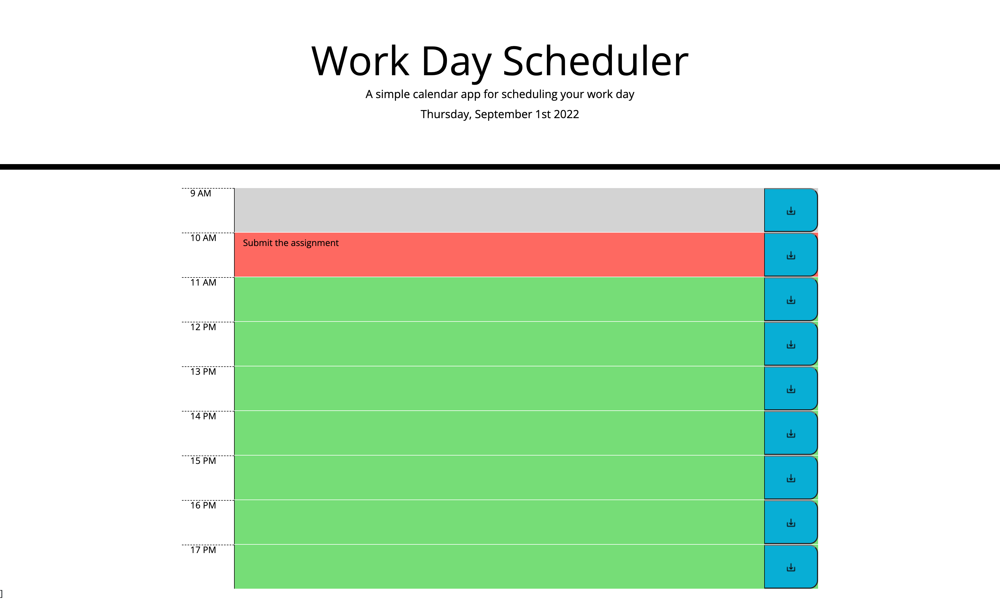

<h1>Assignment04-Save-The-TASK</h1>

This assignment is about creating a Work Day Scheduler, the color of the grid should change as per time and you should be able to add your Task or reminders and Save it and if you refresh, the added notes should be displayed

<ol>
<li>The Work Day Scheduler displays time from 9AM to 5PM</li>
<li>If the time is past the color of the grid will be grey, if its a present time it will be displayed as red and if its future time it will be displayed in green</li>
<li>A new icon is added for the save button, instead of just a simple 'Save' text</li>
<li>Enter the required notes and click on Save to Save the notes</li>
<li>Click on refresh and view that the notes will still be displayed</li>
<li>The next day its a new page again to enter the details</li>
</ol>

<h3>Link of Github</h3>

https://github.com/rimadas9878/Assignment05-Save-The-Task

<h3>Link of Website</h3>

https://rimadas9878.github.io/Assignment05-Save-The-Task/

<h3>Image of the Work Day Scheduler</h3>
